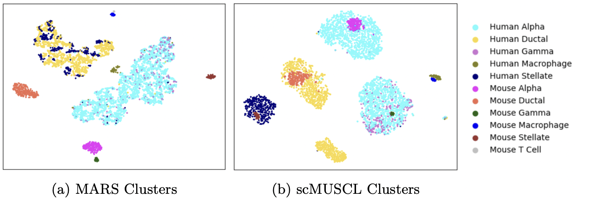

# scMUSCL

This is the official implementation for scMUSCL, a multi-source transfer learning method for clustering cells using scRNA-seq data. 

scMUSCL is a three-stage method where transfer learning occurs in all three stages. The first stage is the contrastive pre-training of the feature extractor which initializes a feature space such that similar cells are mapped closer to each other. Then comes the cluster initialization stage where we initialize two sets of clusters for source datasets and the target dataset. Fine-tuning is the final stage where scMUSCL utilizes source and target datasets to fine-tune the learned feature representations in order to fully align source and target datasets. During fine-tuning scMUSCL further exploits the source datasets to learn a clustering for the target dataset. Fine-tuning is guided by a loss function consisting of two terms. The first term performs a cell-level alignment. It aligns different source datasets and learns compact clusters in the source and target domains. The second term performs a cluster-level alignment and aligns source and target clusters. Extensive experiments on 14 real-world human and mouse tissues show scMUSCL's superiority over previous state-of-the-art scRNA-seq clustering methods.




## Setup

```
pytrhon3.8 -m venv ENV
source ENV/bin/activate
pip install -r requirements.txt
```

## Datasets 
We used 14 datasets to run our experiments. These datasets are listed in table below. Please note PBMC dataset by Ding is actually 7 different batches sequenced by 7 different technologies.
| Specie | Tissue | Source |
| --- | --- | --- |
| Mouse | Pancreas | Baron |
| Mouse | Pancreas | Tabula Muris |
| Human | Pancreas | Baron |
| Human | Pancreas | Segerstolpe |
| Human | Pancreas | Murano|
| Human | Kidney | Park |
| Mouse | Kidney | Tabula Muris |
| Human | PBMC | Ding |

All 14 preprocessed datasets can be downloaded from [here](https://drive.google.com/file/d/1cY6CLKYfuGqzBMWTaVsKjbWr0k_6jNKP/view?usp=sharing).


## Running Experiments

Before running any experiments (cross-species, cross-tissue, and cross-platform), make sure that you first set the dataset path in the corresponding YAML file in *configs/*. You will need to set three parameters in each YAML file: data_path, source, and target. Other parameters are set to the default values, values similar to what we used to run experiments reported in the paper.

Then you can run the experiment's main file to get the results. For example for running cross-platform experiments you need to first set data parameters in *configs/cross_platform.yml* as stated in the previous paragraph and then run: 

```
python main_cross_platform.py
```

The result will be written inside *output/result/cross_platform* directory.

